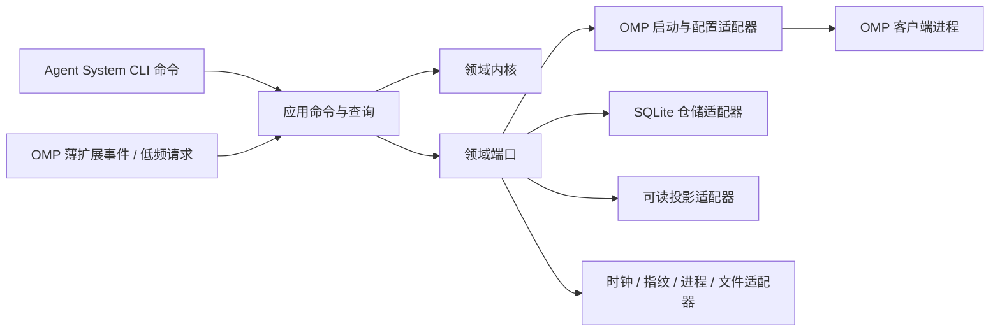
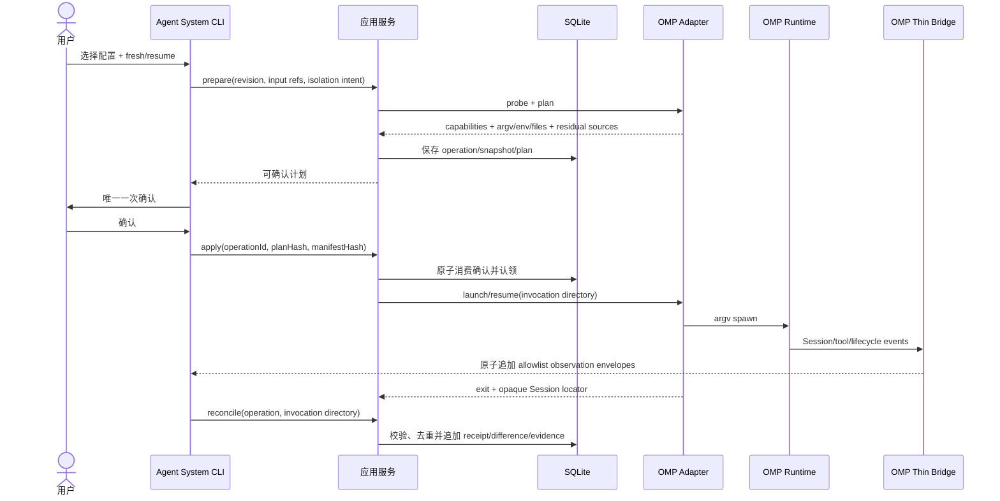
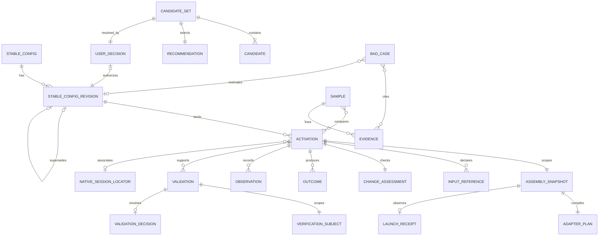

# 架构脊柱 — Agent System MVP

## 设计范式

采用**六边形模块化单体**，以外部 Agent System CLI 为唯一组合根。领域内核定义稳定配置、装配事实、激活、验证与演进规则；应用层拥有全部产品状态变更入口；客户端、SQLite、可读投影、时钟、指纹和进程启动均为适配器。MVP 只实现 OMP adapter；薄 OMP extension 只桥接 PRD 已要求的会话内命令/工具与生命周期观察，不拥有领域状态或配置决定。部署为一个 Bun CLI 加一个同语言薄扩展，不引入 daemon、服务、队列或通用 IPC 总线。



依赖只能指向内层。`domain` 不得导入 OMP、Bun、SQLite、文件系统、进程环境或投影格式；adapter 不得自行做产品决定。OMP、未来 Claude Code/Codex adapter 均实现同一窄端口，但端口只统一装配意图、能力声明和证据，不统一客户端配置文件、Session 或 hook 语义。

## MVP 范围边界（epics.md 为准）

当前锁定的 MVP 范围由 [`epics.md`](../../epics.md) 权威定义：1 个 Epic（查看、选择并使用 OMP 配置）、2 条 Story（1.1 查看与比较配置内容、1.2 选择配置并使用 OMP），覆盖 MVP-FR1～MVP-FR10，OMP-only。本架构脊柱其余正文描述的是完整目标态架构，供未来阶段参考；epics.md AR15 记录了负责人本轮对以下条款的明确裁决，覆盖内容详见对应 AD 内嵌的"MVP 边界"标注与文末 `## Deferred` 小节：

- **AD-16（候选、推荐与用户裁决）：** MVP 不实现，用户直接从已存在的配置修订中选择。
- **AD-7、AD-13、AD-19 对应条款（explicit resume 启动参数、opaque native Session locator 持久化、Session lease/fencing）：** MVP 不实现，resume 完全由 OMP 原生界面负责。
- **AD-11、AD-17（三层验证独立取证、首轮样本与退出门）：** MVP 期间是外部开发验收门，不是 Story 1.1/1.2 交付给终端用户的产品运行时功能。

上述条款保留为已确认的未来架构描述，不因写在本文档中而自动获得当前实施授权；重开需要新证据与负责人明确裁决（epics.md AR13、AR15、AR16）。

## 不变量与规则

### AD-1 — Clean-slate、OMP-first 与未来边界 [ADOPTED]

- **Binds:** 全部能力
- **Prevents:** 从现有 Python CAP 或历史行为恢复需求，以及把未来三端愿景误写成当前支持。
- **Rule:** 只以 PRD、addendum、当前核实的客户端合同和本轮技术研究为设计输入。现有 Python CAP 仅作 Bad Case 证据，不是需求、架构或迁移基线。MVP 只实现并验收 OMP；Claude Code/Codex CLI 不进入 MVP 完成门。允许且必须保留客户端中立的 manifest、receipt、opaque Session locator 与 adapter port；不得预建第二客户端实现、配置等价层或跨客户端 Session 翻译。

### AD-2 — 外部 TypeScript/Bun 控制面 [ADOPTED]

- **Binds:** WF-1、WF-2、WF-3、全部运行能力
- **Prevents:** 把产品状态锁入 OMP 进程、后续逆向抽取隐含合同，以及提前引入多语言、daemon 或服务运维。
- **Rule:** 产品核心实现为外部 TypeScript CLI，由 Bun 编译为目标平台独立可执行文件；领域内核与 adapters 保持 TypeScript。MVP 不增加 Go、Rust、Python sidecar、后台服务、shell 产品脚本或常驻 daemon。OMP 薄扩展同样使用 TypeScript，但只能消费版本化 launch context、转发低频请求并产生事件 envelope，不得连接产品 SQLite 或复制领域规则。若 Bun 分发在连续两个 release 中因企业批准、签名/杀软、native dependency 或发布链形成实证硬门，外部 core 首选迁到 Go，同时保留 schema/JSONL 合同与 TS 薄扩展。

### AD-3 — 控制面、客户端 adapter 与薄桥职责分离 [ADOPTED]

- **Binds:** WF-1、WF-2、FR-1~14
- **Prevents:** CLI、客户端配置和生命周期 hook 形成互不一致的写路径，或 adapter 将某端语义泄漏到领域。
- **Rule:** 外部 CLI 负责配置选择、普通路径唯一一次确认、启动/恢复、状态查询与导出；应用层是唯一产品状态变更入口。客户端 adapter 只能执行 `probe → plan → launch/resume → interpret`，输入输出均为版本化 DTO。OMP 薄扩展的命令/模型工具只把低频配置修订、样本/Bad Case 与证据请求交给外部应用入口；生命周期事件只追加 observation envelope。桥与 adapter 不得直接改 SQLite、派生 `Verified` 或把一个客户端的 precedence、trust、hook、Session 语义提升为公共合同。

### AD-4 — SQLite 是产品持久权威，客户端状态仍归客户端 [ADOPTED]

- **Binds:** FR-3、FR-5~7、FR-12~14
- **Prevents:** 多文件部分提交、索引漂移、跨 Session 丢失，以及复制客户端凭据/transcript 形成第二权威。
- **Rule:** 外部 CLI 进程内的 Bun SQLite 保存稳定配置修订、候选与裁决、激活、装配快照、差异、观察、验证证据、样本、Bad Case、替代链和 opaque native Session locator。JSON/Markdown 仅为 allowlist 投影，可删除重建；invocation-local manifest/plan/event 文件是传输与诊断工件，不是长期权威。凭据、transcript、客户端缓存和原生 Session 内容始终由客户端拥有，禁止导入产品数据库。SQLite 不意味着 daemon；只有多 writer 查询/订阅或恢复压力被实证后才重开服务化。

### AD-5 — 期望状态采用不可变修订

- **Binds:** FR-1~5、FR-10、FR-13、FR-14
- **Prevents:** 装配时静默修改配置、决定被替代后丢失因果、旧 Session 读取漂移目标。
- **Rule:** 每次稳定配置变更创建新的 `StableConfigRevision`，旧修订不可更新。修订显式记录适用工作、必要源资产引用、有限变体、边界和结构化上下文入口；每次 launch assembly 始终绑定一个具体修订。替代通过 `supersedes` 追加，不覆写历史决定。

### AD-6 — 内容所有权与隐私边界

- **Binds:** FR-3、FR-4、FR-9、NFR-4~6
- **Prevents:** 将动态任务、私域原文、凭据或客户端 transcript 复制进稳定配置、数据库、日志或公共投影。
- **Rule:** 稳定配置和持久记录只保存类型化引用、来源标识、允许公开的摘要、内容指纹、新鲜度证据与可观察状态。任务输入由原始载体拥有；私域原文、凭据、动态任务内容与客户端 transcript 只在调用作用域内读取，禁止持久化。数据库、日志、投影、manifest/plan/receipt、bridge envelope 与 invocation 诊断文件均使用显式 allowlist 并拒绝未知字段；bridge envelope 只允许关联 ID、事件枚举、时间、受控状态/原因码、引用和指纹，禁止 prompt、消息、工具参数/结果、原始错误和 transcript。含实际 secret 值的 runtime launch spec 只存在于受限内存或调用期临时文件，不进入 SQLite、投影、receipt 或诊断；终态或恢复归档完成后安全删除。外部来源、MCP 或客户端能力的 `configured`、`installed`、`connectable`、`applied` 不得推导安全性、可信度或任务适用性；分别以证据表达为 Known/Unknown。

### AD-7 — 激活是 launch-scoped 单元

- **Binds:** WF-2、FR-5~10、NFR-7~9
- **Prevents:** 把进程启动授权误当 Session 永久授权、跨 Session 继承动态状态，或部分装配冒充完成。
- **Rule:** 每次激活声明 `ordinary` 或 `controlled-validation`，并绑定 `operationId`、客户端与实际版本、稳定配置修订、声明输入引用/指纹、隔离意图和 `fresh | resume(opaqueLocator)` 选择器。`prepare` 必须持久化 `ChangeAssessment`，逐项比较目标、约束、权限、风险和必需能力；每项为 Known/Unknown，结果只能是”继续原修订”或”进入低频重判”，影响边界与依据必须可回读。比较所需 Unknown 或实质变化未裁决时 fail closed。流程依次为 `prepare → confirm-once → apply/launch → observe/reconcile`；确认只授权本次 `operationId + planHash`。客户端启动后才记录实际 opaque native Session locator。普通复用只接受当前范围内已 `Verified` 且 ChangeAssessment 允许继续的修订；受控验证可使用候选修订但不得标为普通成功。更换配置必须创建新 operation 并重新启动/恢复客户端；旧确认、动态输入和运行期上下文不得继承。
- **MVP 边界（epics.md AR15）：** MVP 不实现 explicit resume 启动参数，不持久化 opaque native Session locator，也不做 ChangeAssessment 式逐项目标/约束/权限/风险重判——该比较隐含任务语义判断，与 epics.md AR7/NFR8 的”不观察任务运行态”裁决不兼容。本条其余部分（launch-scoped operation、单次确认、fail closed）在 MVP 内如实适用；每次配置选择在 MVP 中都作为新的启动计划处理。

### AD-8 — 事实层级、能力与隔离结果不可折叠

- **Binds:** FR-5~7、FR-9~12、NFR-1~3
- **Prevents:** 用计划参数推断客户端实际生效、把未观察解释为 false，或把“参数传入”冒充 Verified。
- **Rule:** 每次激活创建 `AssemblySnapshot`，规范作用域键为 `operationId + stableConfigRevisionId + inputFingerprintSetHash + clientEnvironmentEvidenceId`。期望装配、adapter plan、launch receipt、运行观察、差异与 Unknown 必须引用同一 snapshot。运行装配轴固定为 `observationStage = planned | launched | observed | verified`；`verified` 只能由客户端专项 observation 与验证规则派生。Validation 的方法轴独立固定为 `validationMethod = mechanical | controlled-integration | real-task`，两轴禁止复用字段或互相推导。capability 固定为 `supported | degraded | unsupported | unknown`；隔离回执必须分别列 `excludedSources`、`residualSources`、`unknownSources`。所有不确定值使用 `Known(value, evidenceRef)` 或 `Unknown(reason, observedAt)`；禁止以 `null`、缺行或 `false` 表示未知。

### AD-9 — 客户端副作用不伪装成数据库事务

- **Binds:** FR-6~10、NFR-1、NFR-2
- **Prevents:** SQLite 已提交而客户端未启动/未生效、重试重复启动，以及无法证明的配置恢复成功。
- **Rule:** SQLite 事务与生成文件、进程启动、客户端运行和 extension 事件不声明原子性。`apply` 携带 `operationId + planHash + assemblyManifestHash`；仓储以条件写入从 `awaiting-confirmation` 原子认领为 `applying`，未认领者不得执行副作用。每个 invocation 使用访问权限受限的独立目录；manifest/plan/launch context 通过同目录临时文件原子替换为不可变工件，并携带 operationId、schema version 与持久化 hash，spawn 或 bridge 消费前必须逐项核对，任何缺失/不匹配只记录 incomplete/Unknown。receipt 与 bridge envelope 只是未信任传输输入；应用 command 在 reconcile 时校验 `eventId + operationId + snapshotId + manifestHash + payloadHash`，以条件插入幂等转为 SQLite 中唯一产品事实。文件存在、退出码或解析成功本身不得改变 Outcome。每次启动与 `prepare` 前认领非终态 operation 做 reconcile，并按 `targetResourceKey` 阻止冲突 apply；失败禁止推测回滚、删除客户端数据或把 incomplete/degraded 标成 success。

### AD-10 — 失败关闭与显式降级

- **Binds:** FR-7~10、NFR-2、NFR-5、NFR-6
- **Prevents:** 缺少必要能力、输入、授权或隔离证据时继续运行，以及可选能力缺失被静默忽略。
- **Rule:** 必需能力/输入缺失、实质变化未裁决、权限不足、证据完整性失败、必要配置源无法排除且无显式接受时 fail closed。只有可选项缺失时允许 `degraded`；结果必须列缺失项、受影响能力、残留配置源、差异与 Unknown。状态集合固定为 `prepared | requires-restart | awaiting-confirmation | applying | observing | succeeded | degraded | failed | incomplete | cancelled`，终态不可原位改写。

### AD-11 — 三层验证独立取证

- **Binds:** FR-11、FR-12、NFR-1~3、NFR-7
- **Prevents:** 机械检查通过即声称真实任务有效，或一次表现被外推为稳定能力。
- **Rule:** 证据等级是封闭集合 `mechanical | controlled-integration | real-task`；每条 Validation 绑定 `VerificationSubject = stableConfigRevisionId + capabilitySetHash + taskAcceptanceId + environmentFingerprint`。三层直接证据只有作用域键完全相同时才能汇总。适用性同时满足必要、充分、不过载。`Verified(subject)` 只能在三层均通过且没有阻断性 Unknown 后派生；验证器读取权威查询模型，不从 Markdown、CLI 人类文本或”进程退出码为零”反解析成功。
- **MVP 边界（epics.md AR15）：** 本条在 MVP 期间是外部开发验收门，用于团队判断本轮 MVP 交付是否达标，不是 Story 1.1/1.2 交付给终端用户的产品运行时功能。

### AD-12 — Bad Case 通过追加事实演进

- **Binds:** WF-3、FR-11~14
- **Prevents:** 个案触发客户端特判、样本不可比、旧决定被静默重写。
- **Rule:** `Sample` 固定目标、输入分类、配置修订、客户端/version 与证据口径；`BadCase` 必须引用失败/差异证据、适用边界和拟议变化。只有明确裁决才创建新修订或规则；替代关系保留旧决定及证据。不得在 adapter 或薄扩展中按任务文本增加特判。Profile 语义、Hard Handoff、每任务实时 Skill Discovery、动态子 Agent 装配和第四类核心资产不得作为默认修复，只能由有界证据与明确裁决重开。

### AD-13 — 并发、Session lease 与升级由仓储边界控制

- **Binds:** FR-5~7、FR-12~14、NFR-7
- **Prevents:** 多 CLI 进程写入覆盖、同一 native Session 被并发 resume、半迁移数据库和不可重现升级。
- **Rule:** SQLite 启用 WAL；所有产品表由事务迁移创建为 `STRICT`。可写转换通过条件写入原子认领并携带期望版本；进程内队列不承担跨进程正确性。对已知 `(clientId, nativeSessionLocator)`，launch/resume 前必须在 SQLite 取得唯一持久 lease，记录 `ownerOperationId + 单调 fencingToken`；从认领到 receipt/observation 证明该 writer 的进程树已结束前不得释放。失联 lease 只能由持有匹配 token 的 reconcile 在证明客户端不再写入后回收；不能证明时 locator 保持 blocked，第二 writer 必须 fail closed 或要求 fresh/fork。数据库持久化 reader/writer schema 版本，只允许事务化前向迁移；版本过高时 fail closed，至多开放只读导出。不得使用 ORM 隐藏条件转换、lease、fencing 与迁移语义。
- **MVP 边界（epics.md AR15）：** MVP 不实现。Session lease/fencing 依赖持久 native Session locator，而 MVP 不持久化 locator（AD-7 的 MVP 边界）；本条整体保留为未来能力，重开需要新证据与负责人裁决。

### AD-14 — CLI、桥与客户端按独立故障域设计

- **Binds:** 全部运行能力、NFR-5~9
- **Prevents:** bridge 异常拖垮客户端、wrapper 被 kill 后伪造成功，或客户端退出后继续副作用。
- **Rule:** 外部 CLI 直接 argv spawn，不经 shell；显式管理 cwd/env/stdio/exit/signal，取消向子进程树传播。薄扩展加载阶段不得执行运行动作；事件、命令和工具边界统一捕获并转换类型化失败；不得用 detached promise。launch context、bridge request/response 与 observation envelope 均携带 `operationId + snapshotId + assemblyManifestHash + invocationId`；请求另有 `requestId`，观察另有全局唯一 `eventId` 与单写者序号。桥只按 AD-6 allowlist 原子追加 invocation-local envelope；CLI 在进程退出、显式 reconcile 和下次启动恢复时扫描，经应用 command 验证关联、顺序、hash 与幂等后入库。迟到、重复、冲突或不匹配 envelope 记录为 uncorrelated Unknown，绝不更新 Observation/Validation。桥写失败不得阻止 OMP 原生退出但使对应 observation 为 Unknown。CLI 被 kill 后留下的非终态 operation 只能 reconcile 为可证明结果或 incomplete，不自动重放副作用。

### AD-15 — 控制面发布、客户端升级与高频激活分离

- **Binds:** WF-1、WF-2、NFR-8、NFR-9
- **Prevents:** 每次激活安装/升级，以及客户端 contract churn 无门进入。
- **Rule:** 外部 CLI 以 Bun standalone artifact 分平台发布；OMP 薄扩展通过 Marketplace、Git 或本地 link 分发，但必须与 CLI protocol version 显式兼容。安装/升级是低频显式操作，普通激活不得安装依赖、改插件或联网更新。每个支持客户端的实际版本升级先运行 capability probe、adapter fixtures 与 fresh→locator→explicit resume 目标 smoke，再更新兼容 snapshot。文档声称但 release-pinned CLI/help/source 或 smoke 未证实的能力保持 Unknown。

### AD-16 — 候选、推荐与用户裁决可追溯 [ADOPTED]

- **Binds:** WF-1、FR-1、FR-2、NFR-6、NFR-9
- **Prevents:** Agent 直接固化首个方案、候选同质化、用户纠偏丢失和低风险决定反复升级。
- **Rule:** 低频配置建立/修订命令必须先持久化触发类别 `new-scenario | known-insufficiency | bad-case` 及对应真实工作引用或证据 ID；缺失时拒绝创建 CandidateSet，单纯发现资产、历史存在或技术可行性不得触发。随后持久化 `CandidateSet`、明确 `Recommendation` 与 `UserDecision`。默认给出 2~3 个、最多 4 个可区分候选；每项记录来源、行为价值、适用工作、边界、关键差异、依据、风险和 Unknown，对具名方法逐项评估。用户可拒绝、补充或纠偏；只有高风险、权限、不可逆或价值取舍才升级。候选空间已覆盖实质差异后停止扩展。
- **MVP 边界（epics.md AR15）：** MVP 不实现。用户直接从已存在的配置修订中选择，没有 Agent 生成的候选或 Recommendation；本条整体保留为未来能力，重开需要新证据与负责人裁决。

### AD-17 — 首轮样本与退出门固定 [ADOPTED]

- **Binds:** FR-11、FR-12、FR-13、NFR-1~3
- **Prevents:** 以单次表现验收、样本口径漂移、同 Session 自证和无限追加采样。
- **Rule:** 首轮任务固定为 T-1、T-2、T-3；无合适 T-3 时以 T-4 替代并记录理由。每项至少记录 1 个当前基线样本和 2 个稳定配置样本，其中至少 1 个来自 fresh 或明确不同的 native Session。Sample 可比性键固定为任务类型、验收口径/结构、输入可比规则、配置无关的客户端/version/环境能力证据，以及已知外部变化：可重复任务要求等价输入；不可重复的一次性任务只要求相同输入分类/结构及到同一验收口径的映射，输入内容/指纹必须记录但不要求相等。任一可比性键不兼容即强制拆组展示并禁止汇总。基线/稳定配置、配置修订/manifest hash、实际声明输入、capability/receipt/隔离结果和 fresh/resume/Session 关系是必须展示的被比较自变量或分层字段，不得误作相等键，也不得隐藏差异。样本另记录任务期干预、无关上下文、失败类型和 Unknown。达到最小样本门时必须原子追加不可变 `ValidationDecision`，绑定配置修订、样本组、证据与负责人裁决；结果只能是接受、调整、停止，或为一个具名 Unknown 追加一次预先说明区分力的采样。
- **MVP 边界（epics.md AR15）：** 与 AD-11 相同处理——本轮是外部开发验收门，不是 MVP 产品运行时功能，不向终端用户暴露样本/ValidationDecision 界面。

### AD-18 — 激活转换表唯一且持久

- **Binds:** FR-5~10、NFR-1、NFR-2、NFR-8
- **Prevents:** 内存确认与持久确认并存、adapter 自选终态，以及取消/恢复后倒退状态。
- **Rule:** 唯一合法转换为 `prepared → requires-restart | awaiting-confirmation | failed | cancelled`；`awaiting-confirmation → applying | failed | cancelled`；`applying → observing | failed | incomplete`；`observing → succeeded | degraded | failed | incomplete`。确认事实持久化 `operationId + planHash + assemblyManifestHash`，只能一次原子消费。in-session 配置切换返回终态 `requires-restart`；新进程/恢复必须创建新 operation。恢复只能沿表前进并追加事实，不能倒退或覆写终态。

### AD-19 — Manifest、capability 与 receipt 是客户端兼容合同 [ADOPTED]

- **Binds:** WF-2、FR-5~12、NFR-1~3、NFR-7~9
- **Prevents:** 两个 adapter 各自“合规”却对支持、隔离、恢复或成功含义不兼容。
- **Rule:** `AssemblyManifest` 只表达 client、project root、configuration revision、instructions/skills/MCP 引用、capability policy、isolation intent 与可选 resume selector；不得包含客户端原生配置结构。每项 capability 以稳定 `capabilityId` 声明 `required | optional` 和目标 observation predicate；plan、receipt 与 Difference 必须沿用相同 ID。事实主体是封闭集合 `configured | installed | discovered | enabled | connectable | connected | approved | applied | used`；plan 返回 `capabilityStatus = supported | degraded | unsupported | unknown`，receipt 返回 `effect = applied | ignored | unknown`，二者均携带 subject 与 evidenceRef，缺项为 Unknown 或按 required fail closed。isolation intent 以版本化 `SourceId` 集合声明每个来源的所需 disposition；plan/receipt 对每个 SourceId 恰好返回 `excluded | residual | unknown`、作用域和 evidenceRef，发现未声明新来源必须追加 unknown。持久 `AdapterPlan` 只保存 argv 结构、环境键、secret/content 引用、不可逆 hash、generated-file metadata 和预期观察；实际环境值/文件内容只进入 AD-6 的非持久 `RuntimeLaunchSpec`。`LaunchReceipt` 返回 effect、`observationStage`、opaque native Session locator、exit 与 allowlist 诊断；Validation 独占 `validationMethod`。全部字段为版本化 tagged union；未知字段、版本或不可观察结果必须 fail closed 或显式 degraded/unknown。
- **MVP 边界（epics.md AR15）：** `resume selector` 与 opaque native Session locator 字段在 MVP 内保持 schema 预留但不产出、不消费实际值——resume 完全由 OMP 原生界面负责。MVP 内 capability 覆盖范围仅服务 MVP-FR6（状态查看）与 MVP-FR9（native-first 辅助面），不含候选/推荐相关 capability。

## 一致性约定

| Concern | Convention |
| --- | --- |
| 标识符 | 产品实体使用不透明 UUID；`operationId` 贯穿命令、invocation 目录、日志、证据和投影；native Session locator 是按客户端 namespaced 的不透明值。 |
| 时间 | UTC RFC 3339；同时记录采集时间与来源声明时间，不用文件 mtime 推断业务新鲜度。 |
| 事实值 | `Known<T>` / `Unknown` tagged union；Unknown 含原因码与观察时间。 |
| 能力 | `supported | degraded | unsupported | unknown`；不得用布尔值压平。 |
| 运行装配证据 | `observationStage = planned | launched | observed | verified`；退出码零至多证明 launched/exit，不证明配置 verified。 |
| 验证方法 | `validationMethod = mechanical | controlled-integration | real-task`；与 observationStage 是独立轴。 |
| 错误 | 应用层返回封闭类型化错误联合；adapter 保留 cause，用户输出与投影只暴露 allowlist。 |
| 状态变更 | 仅应用 command 可写；query、projection、adapter probe 与 lifecycle observation 不改期望状态。 |
| 事件命名 | 领域事实用过去式；OMP/Claude/Codex 原生事件名只存在于各自 adapter/bridge。 |
| 日志 | 至少含 `operationId`、client/version、阶段和结果码；默认拒绝 prompt、凭据、私域原文、transcript 与工具参数。 |
| 配置 | 稳定配置引用 Instructions、Skills、MCP 与结构化输入入口；动态任务内容不进入修订。 |
| 数据库 | 参数化 SQL、显式列、`STRICT`、事务迁移；禁止 `SELECT *` 进入投影。 |

## 语言与技术栈选择

| 候选 | 运行与客户端集成 | 类型与测试 | 分发 | 长期维护成本 | 结论 |
| --- | --- | --- | --- | --- | --- |
| TypeScript + Bun | 外部 CLI 与 OMP 薄扩展同语言；adapter 直接生成 argv/env/files，扩展使用 OMP TS API | schema/types/fixtures 单栈；`bun:test` 覆盖 core、repository 与 adapters | Bun standalone executable；扩展经 Marketplace/Git/local | 少一个跨语言 schema 边界；风险是 Bun 企业批准与 OMP API churn | **采用** |
| Go + TS bridge | Go core 外部进程，OMP 仍需 TS bridge | 静态类型与测试强，但需生成类型和跨语言 golden fixtures | 原生二进制发布成熟 | 两语言；若 Bun 发布链实证失败则是最小反转 | **条件性第一反转** |
| Rust + TS bridge | 与 Go 相同，交叉目标常需 linker/toolchain | 类型与内存安全强 | 独立二进制强 | 构建与认知成本最高；当前控制面无对应资源/安全硬门 | 不采用 |
| Python/纯脚本 + TS bridge | 依赖解释器/venv 或额外打包；仍需 TS bridge | 运行时类型与环境一致性额外维护 | zipapp 仍需解释器，venv 不可搬迁 | 双栈、环境漂移、并发恢复与五年 churn 成本最高 | 不采用 |

### 冷启动版本种子

| Name | Version policy |
| --- | --- |
| Bun | 实现时在 lock/toolchain 中精确钉住；OMP `main` 的移动值不得作为产品 toolchain 决定 |
| TypeScript | 产品 lockfile 精确钉住；不得把文档中的 semver range 当兼容证明 |
| OMP | 首个支持版本只由 release-pinned probe 与真实 smoke 生成 capability snapshot；不从 `main` 推导 |
| SQLite | 与钉住的 Bun runtime 同版本发布，仓储合同验证 `STRICT`、WAL 与迁移 |
| 测试运行器 | 使用同一钉住 Bun 的 `bun:test` |

这些只是冷启动种子。代码落地后，包清单、lockfile、capability snapshots、adapter fixtures 和目标 smoke 共同拥有兼容事实；官方 `main` 或训练数据不得替代发布证据。

## 结构种子

以下结构只固定边界和所有权；完整字段与表布局由合规代码拥有。

```text
packages/
  control-plane/
    src/
      cli/                     # 唯一外部用户入口与组合根
      domain/                  # 纯领域实体、不变量、状态机、事实层级
      application/             # commands、queries、ports、DTO
      adapters/clients/omp/    # probe、plan、launch/resume、interpret
      adapters/sqlite/         # repository、transaction、migration
      adapters/projection/     # allowlist JSON/Markdown
      adapters/system/         # process、clock、fingerprint、invocation files
    migrations/
    schemas/                   # manifest、plan、receipt、bridge event
    tests/
      domain/
      contracts/
      integration/
      smoke/
  omp-bridge/
    src/index.ts               # 低频 request 与 lifecycle event；无领域状态/DB
```





不部署远程服务、队列、共享数据库或产品遥测。真实客户端配置只生成在 invocation/profile 隔离边界内；不清空、改写或恢复真实用户全局配置。OMP bridge 不假设完全隔离；它只报告实际观察。in-session 配置切换返回 `requires-restart`，由外部 CLI 创建新 operation 并以新 manifest 启动/恢复。

## 能力 → 架构映射

| Capability / Area | Lives in | Governed by |
| --- | --- | --- |
| WF-1 配置建立与修订；FR-1~4 | domain/config、application commands、CLI、OMP bridge request | AD-3、AD-5、AD-6、AD-16 |
| WF-2 高频激活；FR-5~10 | domain/activation、application、OMP client adapter、process runner | AD-7~10、AD-18、AD-19 |
| 三层验证与首轮样本；FR-11~12 | domain/validation、application queries、integration/smoke | AD-8、AD-11、AD-17 |
| WF-3 样本与 Bad Case；FR-13~14 | domain/evolution、application commands、CLI/bridge request | AD-5、AD-12、AD-17 |
| 跨 Session 追溯 | SQLite adapter、queries、projection、opaque locator | AD-4、AD-7、AD-13 |
| 隐私与授权；NFR-4~6 | reference policy、projection、client adapter/bridge | AD-6、AD-10、AD-14 |
| 机械检查与低激活负担；NFR-7~9 | application、CLI、capability probe、测试门 | AD-11、AD-15、AD-19 |
| 后续客户端接入边界 | client adapter port、manifest/plan/receipt schemas | AD-1、AD-3、AD-19 |

> **MVP 范围提示：** 当前锁定 MVP（epics.md）只落地与 MVP-FR1～MVP-FR10 对应的部分。"WF-1 配置建立与修订"行中的候选/推荐（AD-16）与"跨 Session 追溯"行中的 opaque locator 持久化（AD-7/AD-13/AD-19 对应条款）延后；"三层验证与首轮样本"行（AD-8、AD-11、AD-17）在 MVP 期间是外部开发验收门，AD-8 的事实层级/Known-Unknown 表达本身仍在 MVP 内用于状态视图。

## 验证边界

- **Schema/类型合同：**独立 TypeScript 检查锁定领域 union、应用端口、manifest/plan/receipt/bridge schemas；未知字段或版本不得被宽松吞掉。
- **领域层：**`bun:test` 覆盖唯一转换表、确认消费、Known/Unknown、capability/evidence levels、AssemblySnapshot/VerificationSubject、修订替代、fail-closed、degraded 与 Verified 派生；不加载 OMP 或真实 SQLite。
- **仓储合同：**对 `:memory:` 与文件 SQLite 运行相同 contract；覆盖 `STRICT`、跨连接认领、native Session lease、唯一键、乐观冲突、非终态恢复、schema 版本过新只读降级、迁移失败、幂等与 WAL 重开。
- **隐私合同：**以含 prompt、凭据、私域原文、transcript、工具 payload 和未知新增字段的夹具验证数据库、日志、投影、manifest/plan/receipt、bridge envelope 与 invocation 诊断不泄露；runtime secret 只存在于调用作用域，任一受限字段落盘时测试失败。
- **Adapter contract：**同一 manifest 生成确定的持久 plan 与非持久 RuntimeLaunchSpec；持久 plan 只含环境键/引用/hash，不含 secret/content；覆盖 capabilityId/subject、required/optional、SourceId 完备 disposition、supported/degraded/unsupported/unknown、resume selector、cwd/env、退出码与 receipt 解释。
- **故障实验：**实际杀死 wrapper 或 OMP，验证工件 hash/权限/关联不匹配只产生 incomplete/Unknown、envelope 可幂等导入、runtime secret 与终态工件按合同清理；覆盖同一 native Session 两个 writer 只有一个 fencing lease，不能证明遗留进程停止时 locator 保持 blocked。
- **目标 OMP smoke：**在钉住 OMP/Bun artifact 上执行 fresh→取得 opaque locator→explicit resume；完成配置修订、Skills/MCP 启动装配、extension observation、失败重试与导出；覆盖非 ASCII/空格路径、既有全局配置、未知 capability 与 bridge 不可用。
- **产品验收：**按 AD-17 执行 T-1/T-2/T-3（或记录理由的 T-4），每任务 1 个基线加 2 个稳定配置样本且至少 1 个不同 native Session；自动化不能替代真实任务观察。

## Deferred

- 稳定配置、证据与 Bad Case 的完整字段 schema：实现故事在不违反 AD-5、AD-6、AD-8、AD-11 下确定。
- CLI 命令名、OMP bridge 工具名、TUI 文案与投影视图：UX/实现层决定，不得改变职责、状态所有权或一次确认上限。
- Claude Code/Codex adapter 实现与产品承诺：MVP 不实现；只有产品合同明确激活第二客户端后，按 AD-19 增量资格，不追求配置或 Session 等价。
- OMP bridge 是否需要同步 tool interception、provider/context mutation 或原生 UI：只有具名用户结果和真实证据出现后扩展；默认只做 PRD 所需低频请求与 observation。
- daemon、远程同步、团队共享状态、服务化、遥测：不在 MVP；只有多 writer/订阅/共享合同明确出现后重开。
- 记录保留、压缩、备份与用户删除 UX：数据量、法规或恢复目标出现后决定；删除不得伪造替代链。
- 本地数据库加密与系统密钥库：当前禁止持久化秘密；若未来必须保存，先建立独立威胁模型与授权合同。
- Profile 产品语义、Hard Handoff、每任务实时 Skill Discovery、动态子 Agent 装配和第四类核心资产：不作默认修复；只有 PRD 新增用户结果/FR、真实任务证据和明确裁决时重开。
- Rust core：仅在出现可测的严格资源/安全边界或关键 Rust-native 组件后重开；“单文件更原生”不足以承担双栈。
- 性能 SLO 与数据库归档阈值：PRD 未给量级；以真实激活测量，出现瓶颈后再定。
- 候选、推荐与用户裁决（AD-16）：MVP 不实现，用户直接选择已存在配置；只有新证据与负责人明确裁决才重开（epics.md AR15）。
- Explicit resume 启动参数、opaque native Session locator 持久化与 Session lease/fencing（AD-7、AD-13、AD-19 对应条款）：MVP 不实现，resume 完全由 OMP 原生界面负责；只有新证据与负责人明确裁决才重开（epics.md AR15）。
- 三层验证与首轮样本退出门作为产品运行时功能（AD-11、AD-17）：MVP 期间保留为外部开发验收门，不向终端用户暴露；只有新证据与负责人明确裁决才重开（epics.md AR15）。
